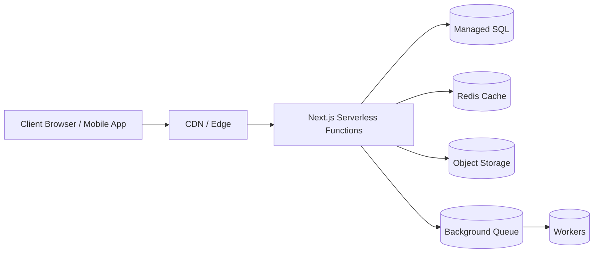
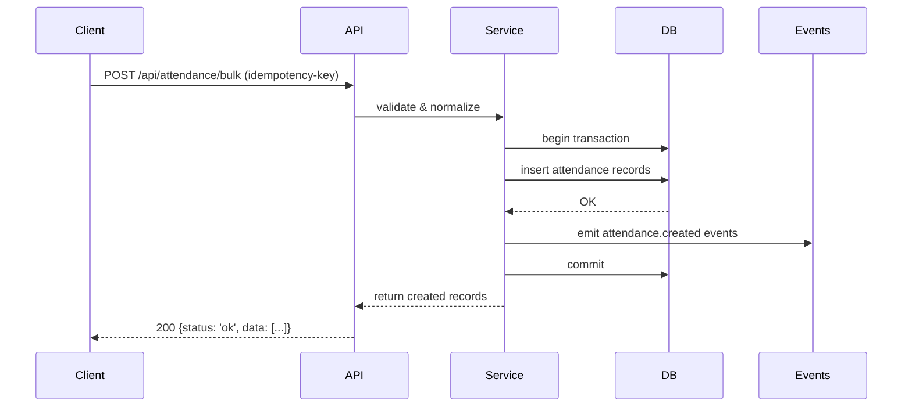

# Educore — Software Design Document

Version: 1.0

Last updated: 2026-06-04

Authors: Platform engineering

Purpose
-------
This document describes the architecture, major components, data model, integrations, deployment and operational concerns for the Educore platform (the Next.js application in this repository). It is intended as a living reference for engineers, product managers, and SREs.

Scope
-----
- Covers frontend and backend architecture, data storage, APIs, auth/authorization, real-time features, mobile considerations, testing, CI/CD, security, scaling, and operational runbooks.
- Assumes codebase rooted at the repository containing the `app/`, `api/`, `lib/`, `events/`, `migrations/`, and `mobile/` folders.

Goals
-----
- Provide a clear mental model of the system and its responsibilities.
- List APIs and data models that must be stable for integrations.
- Capture non-functional requirements (availability, performance, security, scalability).
- Provide runbook-level guidance for deployment, monitoring and incident response.

High-level Architecture
-----------------------

- Client: Next.js (app router) single codebase powering web and PWA/mobile via `mobile/capacitor`.
- Server: Next.js serverless API routes (under `api/`) and backend services in `lib/` and `events/` for real-time behavior.
- Data stores: Primary relational store (SQL; see `migrations/` SQL files) — can be hosted Postgres (Turso or managed cloud provider). Secondary stores (cache, object storage) for large static assets and file uploads.
- Auth: JWT-based tokens (see `lib/jwt.*`), with refresh tokens persisted server-side if required.
- Realtime: WebSockets and/or Server-Sent Events using the `events/` helpers (`websocket-server.ts`, `sse-manager.ts`).

Component Overview
------------------

- Frontend (Next.js `app/`):
  - Pages: implemented with the app router and nested layouts (see `app/(app)/...` directories).
  - Shared components: `components/` and `lib/components/` hold UI primitives and global widgets like `GlobalLoadingSpinner.tsx`.
  - Styles: global CSS files in `app/` root and feature-specific CSS under `app/(app)`.

- Backend (API & Services):
  - API routes: `api/` folder contains request handlers and tests (`__tests__/api`). Each route should validate input and use services from `lib/services/`.
  - Services: `lib/services/` includes domain logic (auth, payments, billing, attendance, etc.). Keep handlers thin — orchestrate through services.
  - Database helpers: `helpers/db.ts` and `lib/db/` abstract query access/ORM usage.

- Events & Real-time:
  - `events/` contains the SSE and websocket support and any change-notification connectors (e.g., `turso-change-notifications.ts`).

- Mobile & PWA:
  - `mobile/` contains Capacitor and platform-specific code to package the web app as native mobile apps. Ensure offline sync strategies are implemented.

Architecture Details
--------------------

This subsection expands on component responsibilities, runtime topology, and common request flows.

- Runtime topology:
  - Edge/CDN (static assets, cached SSR pages).
  - Application layer: serverless Next.js functions (API routes + SSR) running in the cloud provider (Vercel or similar).
  - Persistent services: managed SQL (primary + read replicas), Redis for caching/locks, object store (S3-compatible) for uploads.
  - Async processing: background workers (serverless or container) consuming from a queue (Redis Streams, RabbitMQ, or managed queue like SQS).

- Component responsibilities:
  - API handlers (`api/*`): authenticate, authorize, parse/validate request, call service layer, format response.
  - Service layer (`lib/services/*`): encapsulate domain logic, transactions, and integration with external providers.
  - Persistence layer (`lib/db` / `helpers/db.ts`): provide safe query helpers, migration-aware connection handling, and retries.
  - Jobs/Workers: perform long-running tasks (receipt processing, billing reconciliation, heavy exports).
  - Events layer (`events/`): manage in-memory subscriptions and fan-out to websockets/SSE and push queues.

- Common request flows (examples):
  1. Auth/Login:
     - Client POSTs credentials to `/api/auth/login`.
     - API handler validates credentials via `lib/services/auth` which queries `users` and verifies password.
     - On success, service issues a short-lived JWT and a refresh token (persisted or rotated); returns tokens.
  2. Recording attendance (bulk):
     - Client POSTs bulk attendance to `/api/attendance/bulk` with idempotency-key.
     - API validates, normalizes, and calls `lib/services/attendance.createBulk` which runs in a DB transaction and emits event messages for downstream processing (notifications, analytics).
  3. Payment webhook:
     - Provider sends signed webhook to `/api/payments/webhook`.
     - Handler validates signature, enqueues a job for reconciliation, updates `payments` table, and acknowledges the provider.

Deployment topology diagram (text):

  [Client] -> [CDN/Edge] -> [Next.js Serverless Functions] -> [Managed SQL]
                                      |-> [Redis Cache]
                                      |-> [Object Storage]
                                      |-> [Background Queue] -> [Workers]

Architecture Diagrams (Mermaid)
--------------------------------

Below are lightweight Mermaid diagrams that visualize the deployment topology and a common sequence flow. These can be rendered by many Markdown viewers and used as a basis for more detailed diagrams.

1) Deployment topology



2) Attendance recording (sequence)



These diagrams are illustrative; update them as topology evolves.

Component Interaction Matrix
----------------------------

- `api/*` ↔ `lib/services/*`: request -> business logic
- `lib/services/*` ↔ `lib/db` : services persist and query data
- `lib/services/payments` ↔ payment provider APIs/webhooks
- `events/*` ↔ `websocket-server.ts`/`sse-manager.ts`: event dispatch

Reliability patterns
--------------------

- Idempotency: require idempotency keys for create/bulk endpoints to handle retries.
- Retries & backoff: external calls (payment APIs, email) must use exponential backoff and circuit-breakers.
- Dead-lettering: failed background jobs should be routed to a DLQ for manual inspection.

Performance & caching
---------------------

- Cache-read patterns: cache user sessions, permissions, and hot lookups in Redis with TTLs.
- Cache-invalidation: invalidate on write or use short TTLs for soft consistency.
- Use CDN edge to cache SSR pages that don't contain user-specific data.

Security Architecture
---------------------

- Key management: use managed secret storage with automatic rotation for DB credentials and API keys.
- Network segmentation: restrict DB access to application VPC / allowed IPs and enable connection encryption.


Directory-to-Responsibility Map
--------------------------------

- `app/`: UI surface and route composition
- `api/`: serverless endpoints
- `lib/`: services, utilities, domain logic
- `helpers/`: request and DB helpers used by tests and endpoints
- `events/`: real-time / push event infrastructure
- `migrations/`: schema migrations and data migration scripts
- `mobile/`: capacitor and mobile-specific assets

Data Model (Core Entities)
--------------------------

The exact SQL DDL lives in `migrations/`. Core logical entities used across the app:

- `users` — id, email, password_hash, roles, organization_id, status, created_at, last_login
- `organizations` (schools) — id, name, timezone, billing_info, created_at
- `students` — id, organization_id, name, enrollment_id, dob, class_id, metadata
- `classes` — id, organization_id, name, teacher_id, schedule
- `attendance` — id, student_id, date, status, recorded_by, notes
- `fees` / `invoices` — invoice_id, student_id, amount, due_date, status, items
- `payments` — payment_id, invoice_id, amount, provider, provider_status, external_reference
- `events` / `notifications` — id, type, payload, target_user_id, sent_at

Indexes, partitions and retention policies must be defined based on query patterns (e.g., index `attendance(student_id, date)`).

API Design & Contracts
----------------------

Principles
- Use RESTful, resource-oriented endpoints under `api/`.
- All requests must authenticate (unless public), validate, and return standardized envelope responses.

Examples
- `POST /api/auth/login` — body: `{email, password}` → returns `{accessToken, refreshToken, user}`
- `GET /api/students?classId=...` — returns paginated list with filtering and `X-Total-Count` header
- `POST /api/attendance/bulk` — accepts array of attendance records; use bulk DB operations and idempotency keys for retries

Versioning
- Prefix unstable breaking changes with `/api/v1/...` when introducing incompatible schema or behavior.

Authentication & Authorization
------------------------------

- Authentication: JWT access tokens (short-lived) and refresh tokens (longer-lived) stored and rotated according to security policy.
- Authorization: Role-based access control (RBAC) with explicit scopes per API. Enforce in service layer, not only at route level.
- Sensitive actions (billing, refunds, account deletion) require elevated roles and strong audit trails.

Security Considerations

- Secrets: Keep secrets out of repo; use environment variables and secret manager in CI/CD (Vercel secrets, AWS Secrets Manager, etc.).
- TLS: Enforce TLS for all external traffic. Use HSTS.
- Input validation: Server-side validation for all endpoints (use a schema validator like Zod or Joi).
- CSRF: For cookie-based auth flows, use CSRF protections; prefer Authorization header bearer tokens for APIs.
- Rate limiting: Add a rate limit layer at API edge (CDN or middleware) for authentication and public endpoints.

API Endpoint Catalog (detailed)
-------------------------------

Notes:
- All endpoints return an envelope `{ status: 'ok'|'error', data?: ..., error?: {code,message} }` unless otherwise stated.
- Use HTTP status codes: 200/201 for success, 4xx for client errors, 5xx for server errors.

1) Auth
  - POST /api/auth/login
    - Auth: public
    - Request JSON:
      {
        "type": "object",
        "required": ["email","password"],
        "properties": {
          "email": {"type":"string","format":"email"},
          "password": {"type":"string"}
        }
      }
    - Response 200:
      {
        "status":"ok",
        "data": {"accessToken": "string", "refreshToken": "string", "user": {"id":"uuid","email":"string","roles":["string"]}}
      }

  - POST /api/auth/refresh
    - Auth: public (requires refresh token in body or httpOnly cookie)
    - Request JSON: `{ "refreshToken": "string" }`
    - Response: new `accessToken` and optionally rotated `refreshToken`.

2) Users
  - GET /api/users
    - Auth: requires role `admin|staff` depending on tenant
    - Query: `?page=1&pageSize=50&orgId=...&role=...`
    - Response: paginated list and `X-Total-Count` header

  - GET /api/users/:id
    - Auth: owner or staff

  - POST /api/users
    - Auth: admin
    - Request: create user payload (email, name, role, organization_id)

3) Students & Classes
  - GET /api/students
    - Query filters: `?classId=...&q=name|enrollmentId`

  - POST /api/students
    - Request schema: minimal student object

  - GET /api/classes
  - POST /api/classes

4) Attendance
  - POST /api/attendance/bulk
    - Auth: teacher or staff
    - Request JSON: array of records with schema
      {
        "type":"array",
        "items": {
          "type":"object",
          "required":["student_id","date","status"],
          "properties":{
            "student_id":{"type":"string"},
            "date":{"type":"string","format":"date"},
            "status":{"type":"string","enum":["present","absent","late","excused"]},
            "notes":{"type":"string"}
          }
        }
      }
    - Response: list of created attendance records and an idempotency token echo.

5) Payments
  - POST /api/payments/create
    - Creates invoice and initiates provider flow; returns `payment_url` for redirect flows.

  - POST /api/payments/webhook
    - Auth: public (provider uses signature header); validate with stored secret.
    - Behavior: validate signature, find matching `payments` record by provider reference, update status, enqueue reconciliation job.

6) Webhooks & Background Jobs
  - POST /api/hooks/:name
    - Generic webhook entry — validate origin, enqueue for processing.

Error codes (examples)
- `ERR_VALIDATION` — input validation failed
- `ERR_UNAUTHORIZED` — insufficient privileges
- `ERR_RATE_LIMIT` — throttled by gateway
- `ERR_CONFLICT` — duplicate resource (409)

Data Models (JSON Schema + SQL snippets)
--------------------------------------

User (JSON Schema)
```
{
  "type":"object",
  "required":["id","email"],
  "properties":{
    "id":{"type":"string","format":"uuid"},
    "email":{"type":"string","format":"email"},
    "name":{"type":"string"},
    "roles":{"type":"array","items":{"type":"string"}},
    "organization_id":{"type":"string","format":"uuid"},
    "created_at":{"type":"string","format":"date-time"}
  }
}
```

User (SQL DDL snippet)
```
CREATE TABLE users (
  id UUID PRIMARY KEY,
  email TEXT NOT NULL UNIQUE,
  password_hash TEXT,
  roles TEXT[] DEFAULT ARRAY['user']::TEXT[],
  organization_id UUID REFERENCES organizations(id),
  created_at TIMESTAMP WITH TIME ZONE DEFAULT now()
);
CREATE INDEX idx_users_org ON users(organization_id);
```

Student (JSON)
```
{
  "type":"object",
  "required":["id","organization_id","name"],
  "properties":{
    "id":{"type":"string","format":"uuid"},
    "organization_id":{"type":"string","format":"uuid"},
    "name":{"type":"string"},
    "enrollment_id":{"type":"string"},
    "class_id":{"type":"string","format":"uuid"}
  }
}
```

Student (SQL DDL snippet)
```
CREATE TABLE students (
  id UUID PRIMARY KEY,
  organization_id UUID NOT NULL REFERENCES organizations(id),
  name TEXT NOT NULL,
  enrollment_id TEXT,
  class_id UUID REFERENCES classes(id),
  metadata JSONB DEFAULT '{}',
  created_at TIMESTAMP WITH TIME ZONE DEFAULT now()
);
CREATE INDEX idx_students_org_class ON students(organization_id, class_id);
```

Attendance (SQL)
```
CREATE TABLE attendance (
  id UUID PRIMARY KEY,
  student_id UUID NOT NULL REFERENCES students(id),
  date DATE NOT NULL,
  status TEXT NOT NULL,
  recorded_by UUID REFERENCES users(id),
  notes TEXT,
  created_at TIMESTAMP WITH TIME ZONE DEFAULT now()
);
CREATE UNIQUE INDEX ux_attendance_student_date ON attendance(student_id, date);
```

Payments & Invoices (JSON)
```
{
  "invoice_id":"uuid",
  "student_id":"uuid",
  "amount":123.45,
  "currency":"USD",
  "status":"pending|paid|failed",
  "items":[{"description":"string","amount":100}]
}
```

Guidelines for API implementation
---------------------------------

- Validate requests with a shared schema library (`lib/validators` or Zod schemas kept near services).
- Keep handlers thin: orchestrate with `lib/services/*` and return standardized envelopes.
- Emit domain events for write operations (`created`, `updated`, `deleted`) to the `events/` layer.
- Logging & PII: Redact or avoid logging sensitive PII and tokens. Use structured logs.

Payments & Third-party Integrations
----------------------------------

- Payments: Keep payments logic isolated in `lib/services/payments`. Use webhooks with signature verification. Store provider references and reconciliation info in `payments` table.
- Email/SMS: Use transactional providers (SendGrid, SES, Twilio) and background delivery queues.

Real-time & Notifications
-------------------------

- Choose event delivery model per use-case: immediate websockets for in-app presence and SSE for one-way streams.
- Persist critical events for replay and auditing.

Offline-first & Mobile Sync
--------------------------

- For mobile/Capacitor apps, implement an incremental sync strategy: keep a small change feed (events) that clients can request by last-sync timestamp.
- Use optimistic updates with conflict-resolution rules defined per domain.

Observability & Monitoring
--------------------------

- Metrics: instrument critical paths (API latency, DB query times, background job failures) and export to a metrics backend (Prometheus/Grafana or managed service).
- Tracing: Add distributed tracing for cross-service requests (OpenTelemetry).
- Errors: Capture exceptions with Sentry or equivalent and create alerting for high error rates.

CI/CD & Deployment
------------------

- Platform: `vercel.json` present — prefer Vercel for preview and production deployments.
- Pipelines: PR → preview deploy → automated test runs (unit/jest + playwright e2e) → merge to main → production deploy.
- Migrations: Run DB migrations as a controlled step in deployment (use migration tooling and a migration lock).

Testing Strategy
----------------

- Unit tests: Jest (see `jest.config.js`) for services and utilities.
- Integration tests: run against a test DB container or managed test instance.
- E2E: Playwright for critical flows (see `playwright.config.ts` and `e2e/`).
- Test data: use deterministic fixtures and seed scripts in `migrations/` for stable test setups.

Scaling & Performance
---------------------

- Horizontal scaling: Stateless Next.js instances behind CDN/edge. Use managed DB scaling and read replicas for heavy reads.
- Caching: CDN for static assets and edge caching for SSR pages when possible. Use Redis or in-memory caches for hot data.
- DB performance: add indexes and optimize heavy queries; use pagination and cursor-based APIs.

Backups & Data Lifecycle
------------------------

- Daily backups of primary DB with point-in-time recovery if available.
- Export critical data for offline archival (see `migrations/mongodb-export.js` as inspiration).

Operational Runbook (Incident Response)
-------------------------------------

- Detect: Alerts from monitoring and Sentry.
- Triage: Capture scope, blast radius, and replication steps.
- Mitigate: Rollback, scale replicas, or disable problematic integrations (e.g., webhook processing).
- Postmortem: Document timeline, root cause, and action items.

Data Privacy & Compliance
------------------------

- Minimize PII storage and document retention policies per region.
- Ensure data access controls for staff and maintain audit logs.

Deployment Checklist
--------------------

- Ensure all env vars present in target environment.
- Run DB migrations and verify schema compatibility.
- Run `npm test` and gating e2e tests on PR preview.

Open Questions / Future Work
---------------------------

- Formalize a public API versioning policy and an API gateway for rate limiting.
- Decide on primary DB provider (Turso vs managed Postgres) for production SLA requirements.
- Implement feature flags for large releases.

References (code locations)
--------------------------

- Frontend app: [app](app)
- API routes and tests: [api](api) and [__tests__/api](__tests__)
- Services & helpers: [lib](lib) and [helpers](helpers)
- Events and realtime: [events](events)
- Migrations and DB scripts: [migrations](migrations)
- Mobile packaging: [mobile](mobile)

Appendix: Example API Response Envelope
-------------------------------------

```
{
  "status": "ok",
  "data": { ... },
  "meta": { "paging": { "page": 1, "pageSize": 20 } }
}
```

---

End of document. Keep this file updated as architecture and trade-offs evolve.

Deployment, CI/CD & Migrations (detailed)
---------------------------------------

- CI pipeline (recommended):
  1. Lint & static analysis (TypeScript checks, ESLint)
  2. Unit tests (Jest)
  3. Build step (Next.js build)
  4. Run integration tests against ephemeral test services (test DB)
  5. Deploy preview to Vercel (PR preview) with env vars from secrets
  6. Run Playwright E2E against preview
  7. Merge to `main` triggers production deploy after migration step

- Production deployment steps:
  - Verify env vars and secret availability in the production project
  - Create a migration release: run DB migrations in a locked step (use migration tooling like `node-pg-migrate`, `knex`, or `migrate`)
  - Promote release to production environment and monitor health metrics

- Migration strategy:
  - Backward-compatible migrations preferred: add columns and populate, then backfill usage in code and remove old columns in subsequent deploys
  - For destructive changes, use a two-step migration with feature flags and safe rollouts

- Example deploy commands (local or CI):
```bash
# install
npm ci

# run unit tests
npm test

# build
npm run build

# run migrations (example; adapt to project's migration tool)
npm run migrate
```

Testing & Quality Gates (expanded)
----------------------------------

- Unit tests: Jest — aim for high coverage on services and utility layers. Run with `npm test`.
- Integration tests: run against a disposable test DB (Docker or managed) and include networked integrations in CI `integration` stage.
- E2E tests: Playwright for critical user journeys located in `e2e/`. Run headless in CI and optionally interactive locally.
- Test data & fixtures: Keep deterministic fixtures in `migrations/` or `test/fixtures`. Use factory patterns for test data creation.
- Code quality: enforce TypeScript strict mode and run `eslint --max-warnings=0` in CI.

Security & Compliance (expanded)
-------------------------------

- Secret management: use provider secrets (Vercel/GCP/AWS). Never store secrets in the repo or plain `.env` files for production.
- Dependency scanning: enable automated SCA (dependabot, Snyk) and block high/severe vulnerabilities from merging without fix or mitigation.
- Static analysis: run security-focused linters and TypeScript checks in CI.
- Webhook security: verify provider signatures for all incoming webhooks and enforce replay protection.
- Audit logs: persist an immutable audit log for sensitive operations (billing changes, user role changes, data exports) with operator identity and timestamp.
- Data residency & privacy: document region-specific storage (if needed) and ensure backup retention policies match compliance needs.

Monitoring, Alerts & Runbooks (detailed)
-------------------------------------

- Metrics to monitor:
  - API error rate (5xx, 4xx spikes)
  - Request latency P50/P95/P99
  - Background job failure rate
  - DB connection pool exhaustion
  - Payment webhook failure rate

- Example alerting rules:
  - Page on-call if API 5xx rate > 5% for 5 minutes
  - High error budget burn: P95 latency increases by >2x baseline
  - Worker DLQ length > threshold

- Runbook excerpts:
  - High latency: check recent deploys, DB slow queries, and CPU/IO metrics; rollback if a single deploy correlates.
  - Webhook failures: inspect provider signature errors, replay attempts, and ensure webhook endpoint is reachable.

Postmortem & Incident Process
----------------------------

- Triage and assign severity (P1-P4).
- Capture timeline, mitigation steps, and root cause.
- Identify action items, owners, and due dates. Track postmortem outcomes and ensure follow-ups are implemented.

Finalization Checklist
----------------------

- Ensure `docs/SOFTWARE_DESIGN.md` reflects current architecture and code paths.
- Add architecture diagrams (draw.io, Mermaid) to `docs/` to visualize topology.
- Schedule a design review with stakeholders and update the doc per feedback.

---

End of additions.
